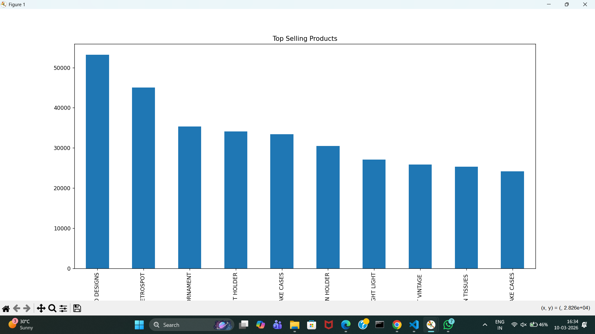
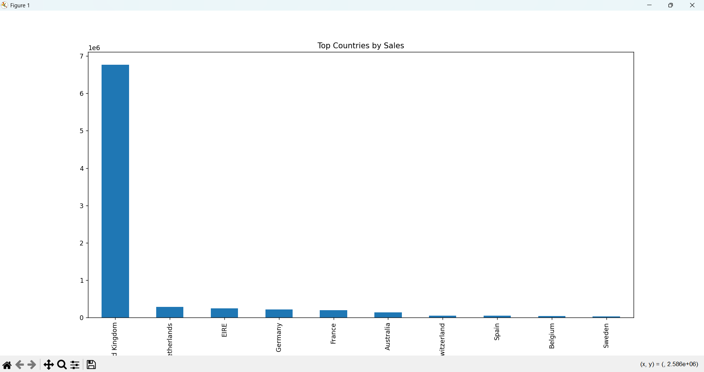
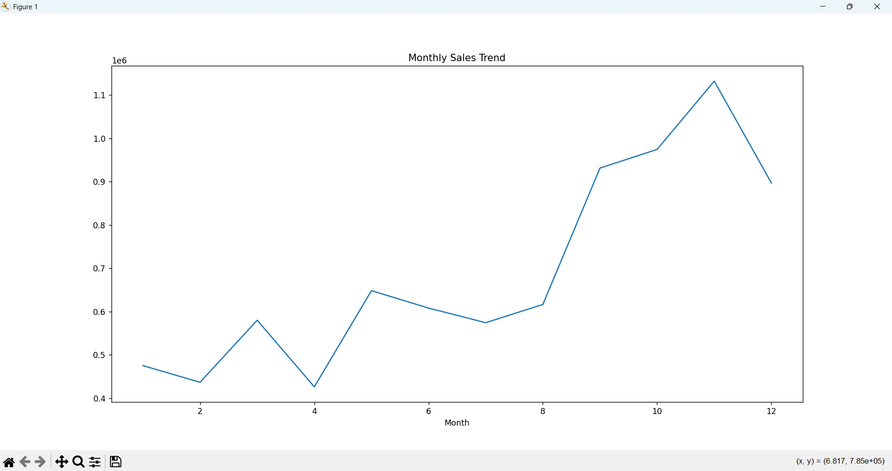

# E-Commerce Customer Analysis

This project analyzes customer purchasing behavior using the Online Retail dataset.  
The analysis identifies top selling products, country-wise sales distribution, and monthly sales trends using Python.

## Technologies Used
- Python
- Pandas
- Matplotlib

## Dataset
Dataset Source: Kaggle - Online Retail Dataset

Download the dataset from:
https://www.kaggle.com/datasets/lakshmi25npathi/online-retail-dataset

## Features
- Data cleaning and preprocessing
- Identification of top selling products
- Country-wise sales analysis
- Monthly sales trend analysis
- Data visualization using graphs

## Output Graphs

### Top Selling Products

### Sales by Country

### Monthly Sales Trend

## Conclusion
The analysis helps identify popular products and countries contributing the most to sales.  
These insights can help businesses understand customer purchasing behavior and improve sales strategies.

